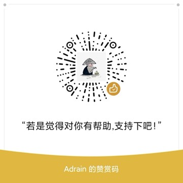

# OTPBox (口令盒子)

A privacy- and security-focused Android two-factor authentication (2FA / TOTP) app. All secrets are stored encrypted on the device, with biometric / PIN app lock, and optional end-to-end encrypted sync via your own GitHub Gist.

> Implements RFC 6238 (TOTP) and is compatible with imports and migrations from mainstream authenticators such as Google Authenticator and Aegis.

## Features

### Account management
- **Scan to add**: real-time scanning of `otpauth://` QR codes using CameraX + ML Kit
- **Import from image**: pick an image containing a QR code from the gallery and recognize it automatically
- **Manual entry**: fill in the secret (Base32) or paste an `otpauth://` link
- **JSON import**: supports OTPBox's own backup format and **Aegis unencrypted exports**
- **Google Authenticator migration**: parse `otpauth-migration://` for bulk import
- Edit issuer / account / note, and delete entries
- Home-screen search and sorting (custom / by issuer / by account)

### Interface
- Modern Material 3 card-based design with brand color theming, dark mode support
- Colorful letter avatars, large monospace codes, one-tap copy
- Global top countdown progress bar (turns color when ≤5 seconds remain)

### Security
- **SQLCipher** encrypted database, with the key wrapped by the Android Keystore (hardware-backed when available)
- Sensitive configuration stored in **EncryptedSharedPreferences**
- **App lock**: unlock with fingerprint / face / device credentials
- **6-digit PIN** fallback unlock (salted PBKDF2 hash)
- **Auto-lock**: immediately / after 1 minute / after 5 minutes
- `FLAG_SECURE` enabled by default to block screenshots and screen recording
- Android auto-backup disabled to prevent secret leakage

### Backup & sync
- **Encrypted export**: key derived with PBKDF2-HMAC-SHA256 (600k iterations) + AES-256-GCM envelope
- **GitHub Gist sync**: manual push / pull; only ciphertext is ever stored in the cloud
- Merged by account ID (`updatedAt` wins; deletion tombstones are respected) for safe multi-device merges
- Backup password and app-lock PIN are independent of each other

## Tech stack

| Area | Technology |
|------|------------|
| Language / UI | Kotlin · Jetpack Compose · Material 3 |
| Architecture | MVVM · Hilt dependency injection |
| Storage | Room + SQLCipher · DataStore · EncryptedSharedPreferences |
| Camera / recognition | CameraX · ML Kit Barcode Scanning |
| Networking | Retrofit · OkHttp · kotlinx.serialization |
| Cryptography | Android Keystore · AES-256-GCM · PBKDF2 |

- **minSdk** 26 · **target/compileSdk** 34
- **Gradle** 8.9 · **AGP** 8.7.3 · **Kotlin** 2.0.21 · **JDK** 21

## Build

```bash
# Configure the Android SDK path (or set sdk.dir in local.properties)
export ANDROID_HOME=/path/to/android-sdk

# Build the debug APK
./gradlew :app:assembleDebug

# Run unit tests
./gradlew :app:testDebugUnitTest
```

Artifacts are placed in `app/build/outputs/apk/debug/`.

## GitHub sync setup

1. Generate a Personal Access Token on GitHub with the **gist** scope
2. Open the app → Settings → GitHub Gist sync, and paste the token
3. Set a backup password (used to encrypt the synced content)
4. The first **Push** automatically creates a private Gist; on other devices, enter the same Gist ID and backup password and **Pull**

> Only the encrypted ciphertext is stored in the cloud Gist; your token and backup password are never uploaded.

## Project structure

```
app/src/main/java/com/otpbox/
├── domain/          # OTP core (Base32, TOTP, URI/migration parsing)
├── data/
│   ├── local/       # Room + SQLCipher
│   ├── crypto/      # Keystore keys, encrypted storage
│   ├── repo/        # Repositories
│   ├── backup/      # Encrypted backup and JSON import
│   ├── settings/    # DataStore settings
│   └── sync/        # GitHub Gist sync and merging
├── security/        # Biometrics, PIN
├── di/              # Hilt modules
└── ui/              # Compose UI (home/scan/add/import/detail/settings/lock)
```

## Security notes

- This app supports **TOTP** (time-based one-time passwords) only.
- All secrets are stored offline and encrypted; uninstalling the app removes them — please make an encrypted backup first.
- If the backup password is forgotten, the encrypted data cannot be recovered. Keep it safe.

## Donate

If this app helps you, feel free to scan the code below to support development:



## License

See [LICENSE](LICENSE).
